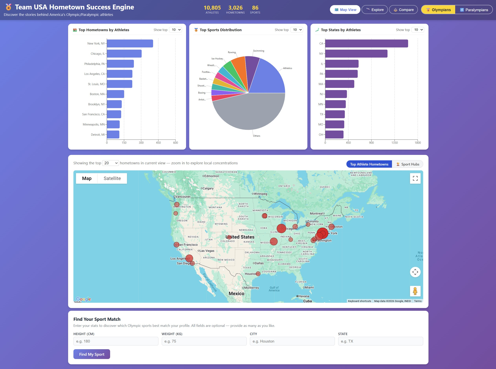

# Team USA Hometown Success Engine

This repository contains the source code for the **Team USA Hometown Success Engine**, a web application designed to explore the origins of American Olympic and Paralympic athletes. It provides a data-rich platform to discover which towns and cities have produced the most successful athletes, analyze regional sport concentrations, and uncover stories about Team USA's hometown heroes.



The application is powered by a Python Flask backend, a React frontend, and Google BigQuery & Google Maps for data storage and analysis, with Google's Gemini AI for generating narrative content. This repo is ready to be deployed to Cloud Run.

## Features

- **Interactive Map**: Visualize the hometowns of Team USA athletes across the United States on an interactive map.
- **Dual Mode**: Seamlessly switch between Olympic and Paralympic athlete data.
- **Explore Mode**: Dive deep into specific sports to see their geographic distribution and key statistics.
- **Compare Mode**: Compare the athletic output of two different cities or states.
- **Hometown DNA**: Get detailed insights for each hometown, including top sports and AI-generated stories.
- **Sport Hubs**: Identify "Sport Leader" cities that are hotspots for specific sports based on athlete count and concentration.
- **Conversational Agent**: Ask natural language questions about the data (e.g., "Which city has produced the most swimmers?").

## Project Structure

The repository is organized into three main parts: the backend service, the frontend application, and the BigQuery data schemas.

```
.
├── backend/         # Flask API and data processing
├── frontend/        # React user interface
└── bq_tables/       # CSV files representing the BigQuery table schemas
```

### Backend

The backend is a Python Flask application that serves a REST API to the frontend. It handles business logic, data queries, and integration with Google Cloud services.

- **`main.py`**: Defines all API endpoints for fetching data, handling user queries, and generating content.
- **`handlers/bigquery_handler.py`**: Manages all interactions with Google BigQuery, containing the SQL logic for querying athlete, hometown, and sport data.
- **`handlers/gemini_handler.py`**: Interfaces with the Gemini API to generate dynamic, AI-powered content like hometown stories and data observations.
- **`handlers/agent_handler.py`**: Powers the conversational agent, parsing user questions and orchestrating calls to BigQuery and Gemini.
- **`Dockerfile`**: Configuration for building and deploying the backend as a Docker container.

### Frontend

The frontend is a modern React application that provides a rich, interactive user experience.

- **`src/App.js`**: The main application component that manages state and routing between different views (Map, Explore, Compare).
- **`src/components/`**: Contains reusable React components for different UI elements:
  - `MapContainer.js`: The interactive map visualization.
  - `StatsPanel.js`: Displays key statistics.
  - `HomtownDetail.js`: Shows detailed information for a selected hometown.
  - `ExploreMode.js` & `CompareMode.js`: UI for the Explore and Compare features.
- **`src/services/api.js`**: A service layer for making HTTP requests to the backend API.

### BigQuery Tables Derived From the Athlete Data

The `bq_tables/` directory contains CSV files that define the schema for the data stored in Google BigQuery. This data is the foundation of the application. All the csv files needed to be injected into Google Bigquery with the same name (e.g. `bq_athletes.csv` -> `your_gcp_project.team_usa_olympics.athletes`).

- **`bq_athletes.csv` / `bq_athletes_para.csv`**: Core tables containing individual athlete data, including name, birth year, and hometown.
- **`bq_hometowns_with_geography.csv` / `bq_hometowns_para_with_geography.csv`**: Contain aggregated data for each hometown, including total athlete counts and enriched geographical features like region, elevation, and climate zone.
- **`bq_sports.csv` / `bq_sports_para.csv`**: Aggregated data for each sport, including the total number of US athletes.
- **`bq_athlete_counts_by_sport_year.csv` / `bq_para_athlete_counts_by_sport_year.csv`**: Pre-calculated counts of athletes per sport for each year, used for historical trend analysis.

## Data Processing and Enrichment

The data powering this application was collected from multiple sources and underwent a significant enrichment process to prepare it for analysis.

### Data Overview

| Category | Athletes | Hometowns | Sports |
| :--- | :--- | :--- | :--- |
| **Olympians** | 10,805 | 3,026 | 86 |
| **Paralympians** | 659 | 522 | 46 |

### Data Sources
*   **Olympian Data**: The roster of US Olympic athletes was scraped from [Olympedia.org](https://www.olympedia.org).
*   **Paralympian Data**: The roster of US Paralympic athletes was obtained via the Team USA API (`https://www.teamusa.com/api/athletes`).

### Geographic and Environmental Enrichment
Once the raw athlete data was collected, it was enriched with several geographic and environmental features:

*   **Coordinate Geocoding**: The latitude and longitude for each athlete's hometown were obtained using the `geopy.geocoders.Nominatim` library.
*   **US Census Region**: Map each state to its corresponding US census region (Northeast, Midwest, South, or West).
*   **Elevation Data**: The elevation for each hometown was fetched from the USGS Elevation Point Query Service API. Any missing elevation values were subsequently inferred based on the location's latitude.
*   **Distance to Coast**: The shortest distance from each hometown to the US coastline was calculated using a coastline shapefile, providing a new `distance_to_coast_km` feature.

The processed athlete data was then used to generate the csv files listed above for interactive analysis.

## Getting Started - Local Testing Instructions

### Prerequisites

- Python 3.11+ (3.13.5 was used) 
- Node.js and npm (Node.js v24.15.0 and npm v11.12.1 were used)
- Access to a Google Cloud Platform project with BigQuery, Google Maps, and Gemini APIs enabled.

### Backend Setup

1.  Navigate to the `backend` directory.
2.  Create a virtual environment: `python -m venv venv`
3.  Activate the environment: `source venv/bin/activate`
4.  Install dependencies: `pip install -r requirements.txt`
5.  Set up your environment variables in a `.env` file (see `.env.example`).
6.  Run the application: `python main.py`

### Frontend Setup

1.  Navigate to the `frontend` directory.
2.  Install dependencies: `npm install`
3.  Run the application: `npm start`


## Deploy to Google Cloud Run

### Backend Setup

1.  Navigate to the `backend` directory.
2.  Activate the environment: `source venv/bin/activate`
3.  Run `gcloud run deploy team-usa-api   --source .  --platform managed  --region us-central1 --allow-unauthenticated --set-env-vars GCP_PROJECT_ID=You-Project-ID --set-env-vars GEMINI_API_KEY=Your_Gemini_API_Key`
4.  After the deployment is completed, there should be a cloud run URL, such as https://team-usa-api-xxxxx.run.app

### Frontend Setup

1.  Navigate to the `frontend` directory
2.  Update the file frontend/src/services/api.js, replace the API_BASE in line 3 by the URL obtained from backend deployment above (i.e. const API_BASE = 'https://team-usa-api-xxxxx.run.app/api')
3.  Run `npm run build`
4.  Run `gcloud run deploy team-usa-ui --source .  --platform managed  --region us-central1 --allow-unauthenticated`
5.  After deployment is completed, you should be able to get the URL for the application, such as https://team-usa-ui-xxxxx.run.app, click it or paste it into the Browser to use it.

## License
[Apache 2.0](https://github.com/sixfu/team-usa-hometown-engine/blob/master/LICENSE)